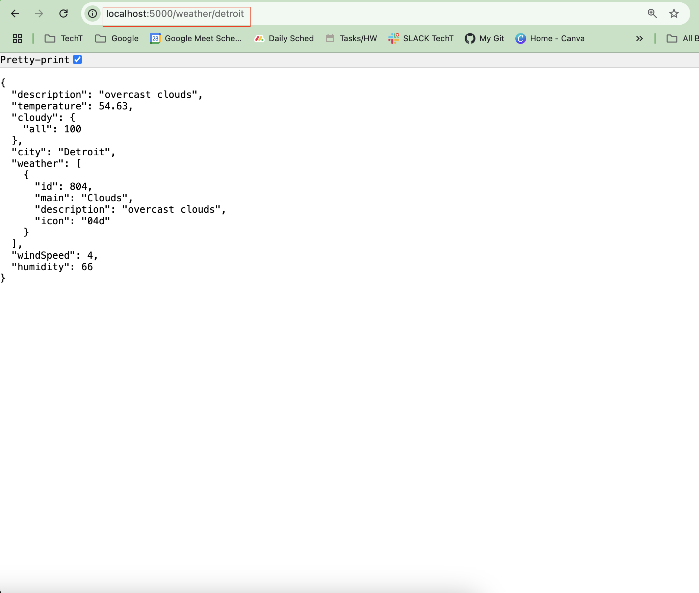
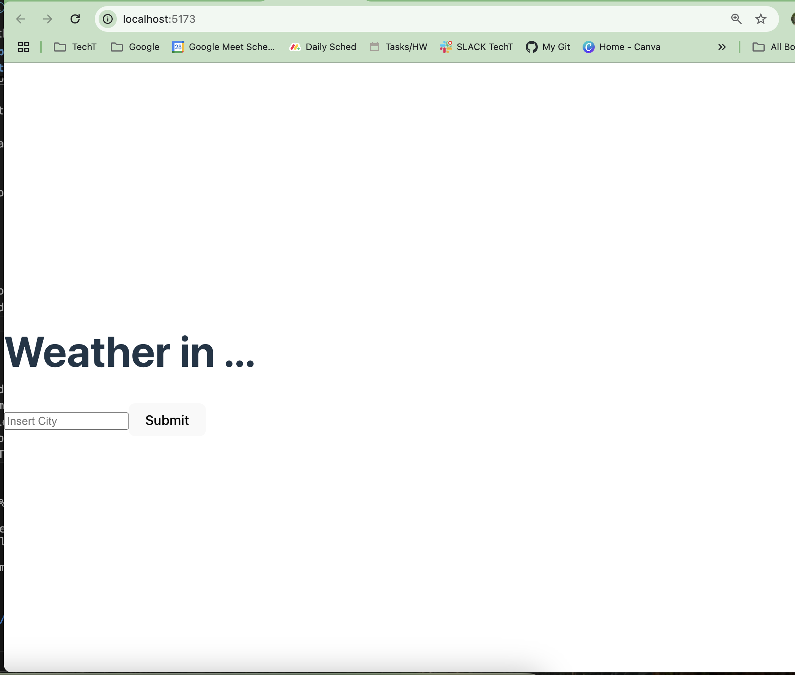

#  Weather App Project
This project pulls live weather data from [OpenWeather API](https://openweathermap.org/api) and displays your current city weather conditions!

## Table of Contents
1. [Installation Instructions](#installation)

2. [How to Set Up Project](#run-project-locally)

3. [Demo](#demo)

## Installation
❗️ My instructions are specified for **MAC users.**  

❗️ Prior to jumping into my project make you install: 

- dotenv
- express
- vite/react

The code editor I used for this project was VS Code. 
- Follow these steps to [install Express](https://expressjs.com/en/starter/installing.html) on your VS Code terminal (they also provide documentation to install node.js)

✅ **You _MUST have these installed_** in order to run my project.

## Run Project Locally
Clone my project below from your terminal

```bash
git clone https://github.com/courjimen/Weather-APP.git
```

Open in VS Code
```bash
code .
```
Navigate to the server folder and open the server.js file then run this command:
```bash
node server.js
```

✅ Open localhost:5000/weather/:city in your browser and replace city with your favorite city in the url to see the backend code



Now navigate to the client folder and open the app.jsx file. Then open a _separate terminal_ you need to have <ins>both <ins> running at the same time ❗️

Run vite in your second terminal for the app.jsx file:

```bash
npm run dev
```
Follow the provided link to localhost:5173 which should display this page:



## Demo
Now you should be able to input your city and see the following weather results:
| City 1 | City 2 |
| -- | -- |
| |  |

That's all folks 🎉 Thank you for checking out my work 🙌🏾